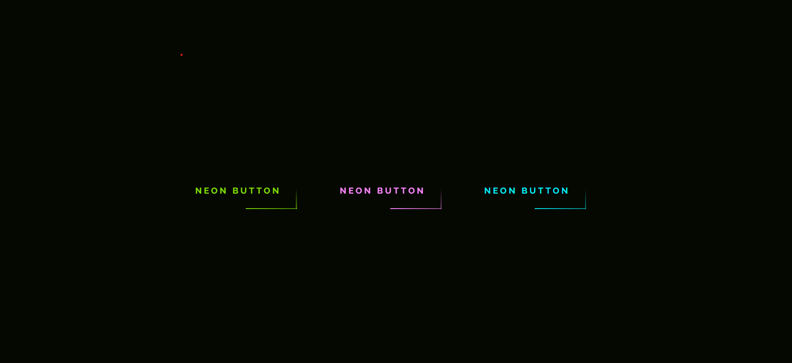

# Desafio-Botao-neon-css

> Desafio de criar uma animação neon para botoes com apenas html e css

### Ajustes e melhorias

O projeto ainda está em desenvolvimento e as próximas atualizações serão voltadas nas seguintes tarefas:

- [x] Tarefa 1      Executar o Desafio e concluir em 3 cores diferentes

## 📫 Quer executar o Desafio e aprender?
Aqui estão os links para executar o projeto

<a href="https://www.youtube.com/watch?v=TGVncD5dtcI&feature=youtu.be">Video ensinando a fazer<a/>
 
<a href="https://www.futurecodersweb.com/2021/05/glowing-neon-buttons-using-html-and-css.html">Post no blog sobre o desafio<a/>
 
<a href="https://fordunn.github.io/Desafio-Botao-neon-css/">Link do site hospedado<a/>
